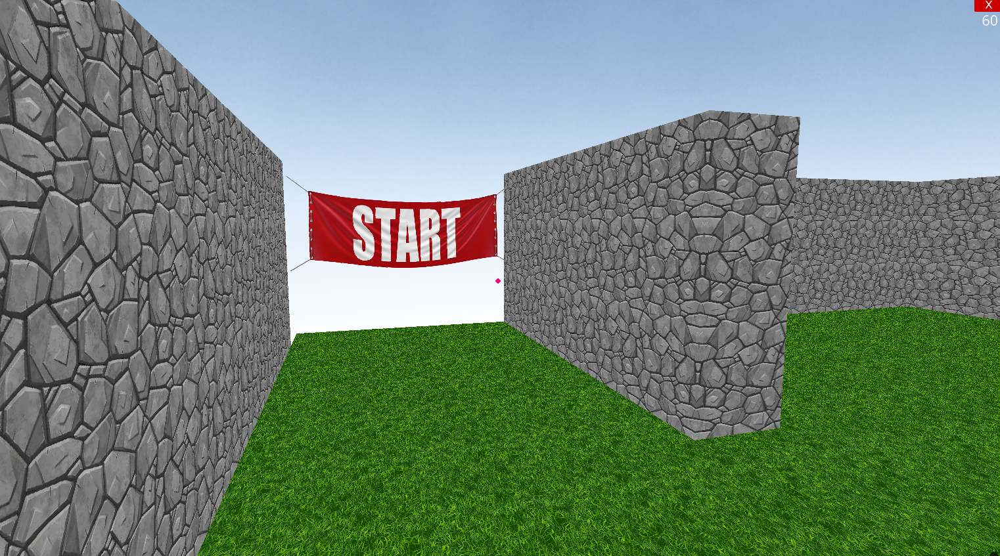
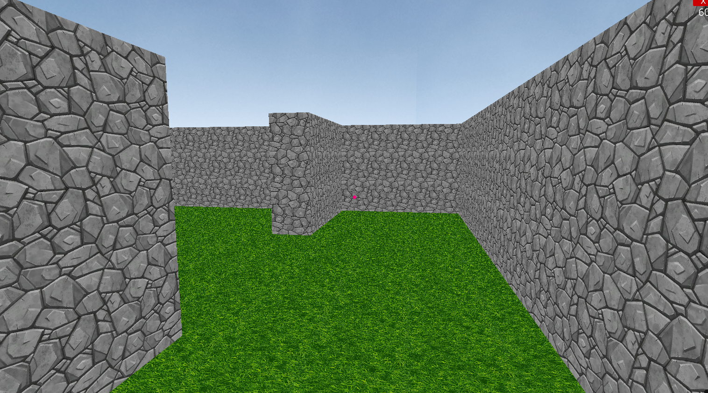

# python-maze-game

A 3d maze game (might be multiplayer in future) created using python. Built using the ursina game engine.

## Usage

```
git clone https://github.com/AshishPandagre/python-maze-game.git
cd python-maze-game
pip install -r requirements.txt
cd "Single Player"
python main_single_player.py
```

## Screenshots

